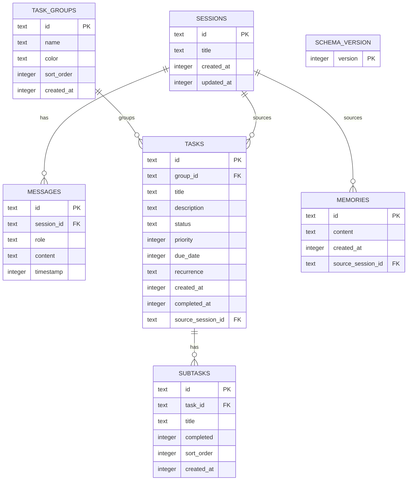

# Database Schema & Offline Storage

KDE Assistant stores chat history, task lists, and memories inside a local SQLite database file.

---

## 1. Database Location

The primary database is stored at:
```
~/.local/share/kdeassistant/chat.db
```

This is a fixed, well-known path that both the plasmoid and webserver daemon can locate without process tree detection.

### Legacy QML Storage (Automatic Migration)
On first run, the daemon detects if a legacy Qt Offline Storage database exists at:
```
~/.local/share/<host-process>/QML/OfflineStorage/Databases/0a6708d6d2377187561fdb538e34d70d.sqlite
```
If found, it is automatically copied to the primary path. The plasmoid continues using Qt LocalStorage (which writes to the QML hash path), while the daemon reads/writes the primary path. Both point to the same data after migration.

### Webserver Daemon Host Matcher
On startup, `webserver_daemon.py` walks its parent process tree (`/proc/<pid>/status`) as a fallback to locate legacy databases if the primary path doesn't exist yet. This ensures backward compatibility during the transition.

---

## 2. Table Definitions

The SQLite database contains six tables initialized in [Database.js](file:///run/media/hadi/SSD2/Coding/KDE%20Assisstant/contents/code/Database.js):



### Table: `schema_version`
Tracks database schema version for automatic migrations.
- `version` (INTEGER PRIMARY KEY): Current schema version number. Starts at `2`.

### Table: `sessions`
Tracks active chat histories.
- `id` (TEXT PRIMARY KEY): Unique identifier (e.g. `sess_1781890200`).
- `title` (TEXT NOT NULL): The auto-generated title or first prompt snippet.
- `created_at` (INTEGER NOT NULL): Epoch timestamp in milliseconds.
- `updated_at` (INTEGER NOT NULL): Timestamp of the last message in this session.

### Table: `messages`
Stores individual conversation blocks.
- `id` (TEXT PRIMARY KEY): Unique message ID.
- `session_id` (TEXT NOT NULL, FOREIGN KEY): Maps to `sessions(id)`.
- `role` (TEXT NOT NULL): The role of the sender. Can be:
  - `"user"`: Prompts sent by the user.
  - `"assistant"`: Plain conversational text generated by the AI.
  - `"system"`: Hidden prompts injected by the environment.
  - `"error"`: Error warning labels.
  - `"memory"`: Saved memory cards.
  - `"task"`: Inline task creation alerts.
  - `"system_command"`: Interactive CLI results.
  - `"setting_approval"`: Command change requests.
  - `"opencode_approval"`: OpenCode autonomous coding approval cards.
- `content` (TEXT NOT NULL): The text payload. For cards, contains a JSON-serialized object:
  - **Memory Card:** `{"id": "mem_xxx", "content": "fact content"}`
  - **Task Card:** `{"taskId": "task_xxx", "title": "...", "groupId": "...", "priority": 0, "dueDate": ""}`
  - **System Command Card:** `{"command": "...", "output": "...", "status": "success|failed|running|pending"}`
  - **OpenCode Card:** `{"instruction": "...", "files": "...", "model": "...", "status": "pending|running|done|failed|declined", "output": "..."}` — Status values: `"pending"` (awaiting approval), `"running"` (executing), `"done"` (success), `"failed"` (error, timeout, or manually stopped), `"declined"` (user rejected). Output for manual stop: `"(Stopped by user)"`. Output for timeout: `"(Timed out after 5 minutes)"`. Output for Plasma restart: `"(Process lost — Plasma was restarted while OpenCode was running)"`.
- `timestamp` (INTEGER NOT NULL): Milliseconds since epoch.

### Table: `memories`
Stores remembered user preferences.
- `id` (TEXT PRIMARY KEY): Unique memory ID.
- `content` (TEXT NOT NULL): The fact content to remember.
- `created_at` (INTEGER NOT NULL): Milliseconds since epoch.
- `source_session_id` (TEXT): The chat session where the memory was saved.

### Table: `task_groups`
Organizes task lists.
- `id` (TEXT PRIMARY KEY): Group ID.
- `name` (TEXT NOT NULL): Group display name.
- `color` (TEXT DEFAULT ''): UI hex color code.
- `sort_order` (INTEGER DEFAULT 0): Order offset for list layouts.
- `created_at` (INTEGER NOT NULL): Milliseconds since epoch.

### Table: `tasks`
Stores individual items in the task manager.
- `id` (TEXT PRIMARY KEY): Task ID.
- `group_id` (TEXT DEFAULT ''): Maps to `task_groups(id)`.
- `title` (TEXT NOT NULL): Task name.
- `description` (TEXT DEFAULT ''): Extra notes or context.
- `status` (TEXT DEFAULT 'pending'): Can be `'pending'` or `'done'`.
- `priority` (INTEGER DEFAULT 0): `3` = High, `2` = Medium, `1` = Low, `0` = None.
- `due_date` (INTEGER): Milliseconds since epoch.
- `recurrence` (TEXT DEFAULT ''): Recurrence rule (`daily`, `weekly`, `monthly`, `yearly`).
- `created_at` (INTEGER NOT NULL): Milliseconds since epoch.
- `completed_at` (INTEGER): Milliseconds since epoch when completed, or NULL.
- `source_session_id` (TEXT): Chat session identifier if created conversationally.

### Table: `subtasks`
Tracks nested lists inside tasks.
- `id` (TEXT PRIMARY KEY): Subtask ID.
- `task_id` (TEXT NOT NULL, FOREIGN KEY): Maps to `tasks(id)`.
- `title` (TEXT NOT NULL): Subtask name.
- `completed` (INTEGER DEFAULT 0): Boolean integer (`1` or `0`).
- `sort_order` (INTEGER DEFAULT 0): Order index.
- `created_at` (INTEGER NOT NULL): Milliseconds since epoch.
