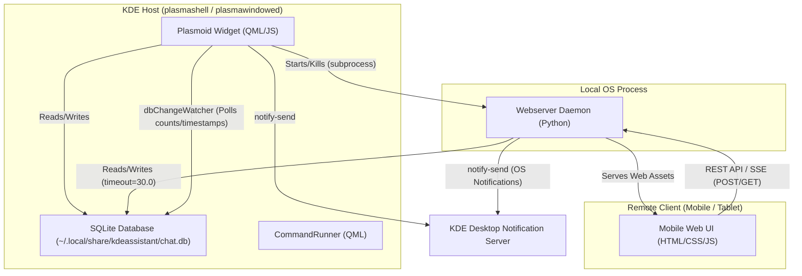

# Software Architecture Map

This document outlines the system architecture of KDE Assistant, showing how the QML Plasmoid, the Python Webserver Daemon, and the Mobile Web UI interact and synchronize data.

## Architecture Overview

KDE Assistant is split into three main components:
1. **Plasmoid (Desktop Client):** The native KDE Plasma 6 widget written in QML and JavaScript.
2. **Webserver Daemon (Background Process):** A zero-dependency Python script (`webserver_daemon.py`) that acts as the backend server.
3. **Mobile Web UI (Remote Client):** A touch-optimized single-page web app built with HTML5, CSS, and Vanilla JavaScript, served by the webserver daemon.

The components communicate via a local database, direct process management, and HTTP REST/SSE APIs:

---

## 7. Dependencies & Deprecated APIs

### plasma5support.DataSource (Shell Command Execution)

KDE Assistant uses `org.kde.plasma.plasma5support.DataSource` with `engine: "executable"` to run shell commands from QML. This is used in `CommandRunner.qml` and is the foundation for all system integrations: shell execution, STT recording, TTS playback, file operations, OpenCode agent, and notifications.

**Why this exists:**
- In Plasma 5, shell commands were executed via `org.kde.plasma.core.DataSource` with the `executable` data engine. When KDE Frameworks 6 removed `DataEngines`, the code was moved to the `plasma5support` compatibility shim.
- There is **no native QProcess API available directly from QML**. `DataSource` with `engine: "executable"` is the only way to execute shell commands in a pure QML Plasma 6 plasmoid.

**Is it deprecated?**
- KDE's documentation describes `plasma5support` as deprecated ("will hopefully be removed in KF6"). However, as of 2026 **no replacement API exists** for pure QML plasmoids.
- KDE Discuss threads (2024-2025) confirm there is no official alternative. The only option is a C++ plugin using `QProcess`, but C++ plugins **cannot be distributed via KDE Store's "Get New" dialog** — they require compilation and system-level installation.

**Status:** Safe to use in production for Plasma 6. The `plasma5support` library is shipped and maintained by KDE as part of Plasma 6. If KDE provides a replacement API in a future KF6.x release, migrate at that point.

**Relevant links:**
- https://develop.kde.org/docs/plasma/widget/porting_kf6/
- https://mail.kde.org/pipermail/kde-devel/2024-February/002460.html
- https://github.com/KDE/plasma5support

### Other Dependencies

| Dependency | Type | Purpose |
|---|---|---|
| Qt 6 / QML | Runtime | UI framework (provided by Plasma) |
| Kirigami | Runtime | KDE-specific QML components (provided by Plasma) |
| Python 3 | Runtime | Webserver daemon (standard library only, no pip packages) |
| SQLite | Runtime | Persistent storage (via QML LocalStorage + Python sqlite3) |
| ripgrep / grep | Optional | Local code search |
| curl | Optional | DuckDuckGo web search fallback |
| arecord | Optional | Audio capture for speech-to-text |
| whisper-cli | Optional | Local speech-to-text |
| spd-say / piper | Optional | Text-to-speech |
| OpenCode CLI | Optional | Autonomous coding agent |

---

## 1. Desktop Plasmoid

The desktop client runs inside the KDE Plasma environment (typically hosted by `plasmashell`, `plasmawindowed`, or `plasmoidviewer` for testing).

- **UI Layer (QML):** Declarative interface files inside `contents/ui/` render the chat interface, task management checklists, memory bank tabs, and configuration screens.
- **Logic Layer (JavaScript):** Zero-dependency JS modules inside `contents/code/` handle LLM completions request construction, attachment reading, Markdown parsing, and SQLite CRUD.
- **Non-Visual Controllers:** Modularized components handle system integrations:
  - `CommandRunner.qml` handles shell command spawning.
  - `SpeechToTextManager.qml` manages microphone input and Whisper transcription.
  - `TextToSpeechManager.qml` sanitizes response text and invokes Speech Dispatcher or Piper.

### OpenCode Autonomous Coding Integration
The OpenCode feature enables the AI to propose and execute code changes autonomously:
- **Command Tag:** The LLM outputs `[opencode: instruction files="..." model="..."]` which is parsed by `TextHelpers.js`.
- **Approval Flow:** `OpenCodeApprovalCard.qml` renders the approval UI with model selection. User approves or declines.
- **Execution:** `FullRepresentation.qml` builds the `opencode run` command, wraps it with `script -q -c` for PTY support, and pipes output through `tee` to a temp log file.
- **Real-time Streaming:** A 1500ms polling timer (`opencodeStreamPoller`) reads the log file, strips ANSI codes, and updates the UI.
- **Manual Stop:** A Stop button appears while the process is running. Clicking it kills the process via `pkill`, marks the status as `"failed"` with output `"(Stopped by user)"`, and cleans up the temp log file.
- **Session Continuity:** The first run captures the OpenCode session ID from the output. Subsequent runs pass `--session <id>` to maintain conversation context.
- **Web Daemon Support:** `webserver_daemon.py` handles the same flow for the mobile web UI, storing the session ID in `/tmp/kde_opencode_session_id`.

---

## 2. Webserver Daemon

The backend daemon is implemented in `contents/code/webserver_daemon.py`. It is a zero-dependency script designed to run natively on any Linux distribution with standard Python 3 libraries.

- **Process Lifecycle:** Started and killed dynamically by [FullRepresentation.qml](file:///run/media/hadi/SSD2/Coding/KDE%20Assisstant/contents/ui/FullRepresentation.qml) when mobile web access is toggled or when Plasma starts/stops. Writes a PID file to `/tmp/kdeassistant_webserver.pid` and detects stale instances on startup.
- **Database Location:** Uses a fixed primary path at `~/.local/share/kdeassistant/chat.db`. Falls back to walking the Linux process tree (`/proc/<pid>/status`) to locate legacy Qt Offline Storage databases if the primary path doesn't exist.
- **SQLite Lock Avoidance:** Uses WAL journal mode, `busy_timeout=5000`, and retry logic with exponential backoff to prevent conflicts during concurrent database write operations between the Plasmoid and Web UI.
- **REST Endpoints:**
  - `GET /api/sessions`: Returns recent chat history logs.
  - `GET /api/messages?session_id=...`: Fetches structured chat messages.
  - `POST /api/messages`: Handles prompt submission and completions streaming.
  - `GET /api/tasks` & `POST /api/tasks/toggle`: Fetches task records and manages completions.
  - `GET /api/memories` & `POST /api/memories/delete`: Manages memory bank entries.
  - `POST /api/commands/action`: Remotely executes approved settings/grep/system tools on the host PC.

---

## 3. Mobile Web UI

Located in `contents/ui/web/`, the web app is a touch-friendly single-page application.

- **Styling:** Vanilla CSS styled with a premium zinc color palette, responsive bottom navigation drawer, dynamic authentication gateway, and collapsible thinking panels.
- **State Syncing:**
  - **Streaming:** Pulls completions from the `/api/messages` SSE stream token-by-token.
  - **Completion Fetch:** Upon stream finalization, the client reloads the messages via `/api/messages?session_id=...` to fetch and render the newly committed tool cards (such as memory registrations or task cards).

---

## 4. Database Synchronization (QML dbChangeWatcher)

Since the Web UI and the Plasmoid are completely separate processes, KDE Assistant uses a data-driven sync system to keep them aligned:

1. **Write Operations:** 
   - When the user sends a message from the mobile browser, the Python daemon saves the prompt and stream tokens directly into the SQLite database.
2. **Watch Polling:**
   - In [FullRepresentation.qml](file:///run/media/hadi/SSD2/Coding/KDE%20Assisstant/contents/ui/FullRepresentation.qml), a low-overhead timer (`dbChangeWatcher`) checks the SQLite database every few seconds.
   - It queries counts and maximum update timestamps for the `sessions`, `messages`, `memories`, and `tasks` tables.
3. **Reactive Reloading:**
   - If the database query indicates that a count or timestamp has changed, QML automatically refreshes its local list models (`chatMessageModel`, `chatSessionModel`, `memoryModel`, `taskModel`).
   - This ensures that messages sent or settings modified on mobile immediately appear on the desktop screen.

---

## 5. Focus & Tooltip Window Activation Stability (Wayland Workarounds)

To prevent the Plasmoid popup window from deactivating and closing automatically (a common bug in Wayland and KWin environments when widgets lose activation/focus), KDE Assistant implements two system-level workarounds:

### Custom Inline Tooltips
- **Problem:** Standard QQC2/Plasma tooltips spawn separate `xdg_popup` top-level windows. When hovered, focus is grabbed by the tooltip window, deactivating the main Plasmoid popup and triggering `hideOnWindowDeactivate: true` which auto-closes it.
- **Solution:** Tooltips are rendered as a single, global inline `Rectangle` (`globalToolTip`) declared at the root level of `FullRepresentation.qml`.
- **Positioning:** Interactive controls call `fullRepRoot.showToolTip(controlID, "text")` on hover. The popup maps the control's local coordinates to the root window using `mapToItem(fullRepRoot, 0, 0)` and positions the tooltip inline, remaining in the same window context.

### Offscreen Focus Keep-Alives
- **Problem:** Switching views (History, Memories, Tasks pages) hides the `ChatPage`, which contains the active `TextArea`. With no text input element visible on the active view, the window's `activeFocusItem` becomes null, causing KWin to deactivate and auto-close the popup upon any pointer hover/interaction.
- **Solution:** Each sub-page component contains an offscreen focus helper (`focusHelper` which is a `Controls.TextField` located at `x: -100`, `y: -100` with dimensions `10x10`, `opacity: 0`, and `readOnly: true`).
- **Propagation:** Calling `forceActiveFocus()` on a subpage delegates keyboard active focus to its respective `focusHelper`, ensuring the window maintains an active text input focus grab in the eyes of the window manager.

---

## 6. Layout & Overlay Architecture

To keep the QML rendering engine efficient and prevent runtime layout warnings/errors, page layouts and modal confirmation dialogues follow a strict hierarchy:

- **Root Item Sibling Pattern:** Pages containing full-screen modal overlays (e.g. `ConfirmOverlay` for deleting items) use a base `Item` as their root rather than a `ColumnLayout` or `RowLayout`.
- **Layout Partitioning:** Inside the root `Item`, the main scrollable elements are enclosed in a child `ColumnLayout` filling the parent, while overlay components (like `ConfirmOverlay` and `DropArea`) reside as siblings to the layout, anchored directly to the root `Item`. This prevents layout engines from attempting to position and scale overlay bounds, maintaining clean rendering behavior.
